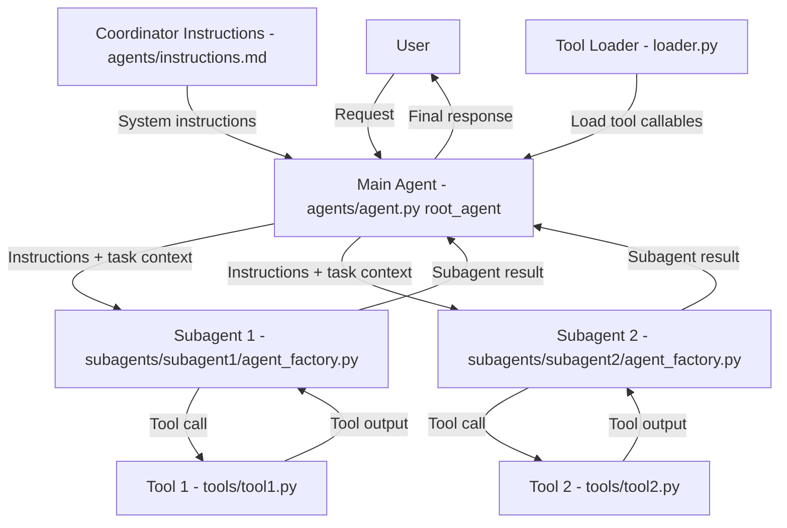

# gemini-live-agent-hack

Boilerplate for a Google ADK Python project with a live Gemini coordinator agent, pluggable tools, and a Google Cloud-native Phase 0 backend.

## ADK Flow Diagram



## Directory Structure

```txt
gemini-live-agent-hack/
├── agents/
│   ├── __init__.py
│   ├── agent.py
│   └── instructions.md
├── config.py
├── main.py
├── subagents/
│   ├── __init__.py
│   ├── subagent1/
│   │   ├── __init__.py
│   │   ├── agent_factory.py
│   │   └── instructions.md
│   └── subagent2/
│       ├── __init__.py
│       ├── agent_factory.py
│       └── instructions.md
├── services/
│   ├── __init__.py
│   ├── firestore_store.py
│   └── storage_store.py
├── loader.py
├── tools/
│   ├── __init__.py
│   ├── tool1.py
│   └── tool2.py
├── .dockerignore
├── .env.example
├── Dockerfile
├── refs/
│   ├── llms.txt
│   └── llms-full.txt
├── requirements.txt
├── .gitignore
└── README.md
```

## Phase 0 Notes

- `agents/agent.py` defines `root_agent` (ADK convention).
- `agents/__init__.py` exposes the module for ADK discovery.
- `loader.py` centralizes tool registration for the coordinator.
- `main.py` is the Cloud Run / FastAPI entrypoint for the backend shell.
- `config.py` validates Vertex-first runtime configuration from `.env`.
- `services/firestore_store.py` and `services/storage_store.py` validate Firestore and Cloud Storage connectivity.
- Default model is `gemini-2.5-flash-live-001`; override with `ADK_LIVE_MODEL`.

## Why Firestore and Cloud Storage

- `Firestore` stores structured application state: sessions, style profiles, design briefs, feedback history, and product metadata.
- `Cloud Storage` stores large binary assets: room snapshots, inspiration images, and generated renders.

One can technically use only Cloud Storage, but that makes session state and querying painful. One can also technically use only Firestore, but it is the wrong place for heavy media files. The split is intentional.

## Local Setup

1. Install the Google Cloud CLI and authenticate:

```bash
gcloud auth login
gcloud auth application-default login
gcloud config set project YOUR_PROJECT_ID
gcloud auth application-default set-quota-project YOUR_PROJECT_ID
```

2. Create and activate a virtual environment:

```bash
python3 -m venv .venv
source .venv/bin/activate
```

3. Install dependencies:

```bash
pip install -r requirements.txt
```

4. Copy `.env.example` into `.env` and fill in your project values:

```env
GOOGLE_GENAI_USE_VERTEXAI=TRUE
GOOGLE_CLOUD_PROJECT=your-gcp-project-id
GOOGLE_CLOUD_LOCATION=us-central1
FIRESTORE_DATABASE=(default)
GCS_BUCKET_NAME=your-gcs-bucket-name
ADK_LIVE_MODEL=gemini-2.5-flash-live-001
APP_NAME=gemini-live-agent-hack
PORT=8080
```

5. Run the Phase 0 backend shell:

```bash
uvicorn main:app --reload
```

6. Verify runtime health:

```bash
curl http://127.0.0.1:8000/healthz
```

## Teammate Bootstrap

Any teammate should be able to run the Phase 0 and early Phase 1 stack by doing the following:

```bash
git clone <repo-url>
cd gemini-live-agent-hack
python3 -m venv .venv
source .venv/bin/activate
pip install -r requirements.txt
gcloud auth login
gcloud auth application-default login
gcloud config set project YOUR_PROJECT_ID
gcloud auth application-default set-quota-project YOUR_PROJECT_ID
cp .env.example .env
# Fill in GOOGLE_CLOUD_PROJECT and GCS_BUCKET_NAME
uvicorn main:app --reload
```

For agent-only iteration, teammates can also run:

```bash
adk web
```

The backend shell and the ADK dev UI serve different purposes:
- `uvicorn main:app --reload` is the Google Cloud-native app shell we will extend in later phases.
- `adk web` is useful for quick agent prompt/tool iteration.

## Cloud Run

Once the runtime service account, Firestore database, and GCS bucket exist, the repo can be deployed with source-based Cloud Run deploys:

```bash
gcloud run deploy gemini-live-agent-hack \
  --source . \
  --region us-central1 \
  --allow-unauthenticated \
  --service-account YOUR_RUNTIME_SERVICE_ACCOUNT
```
