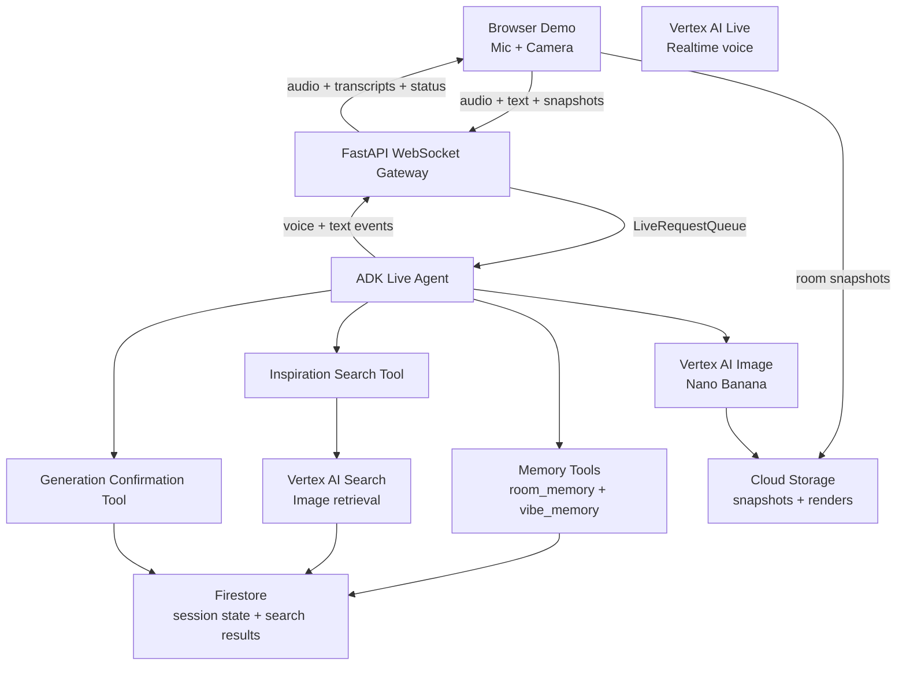

# Room Decorator Agent

Room Decorator Agent is a voice-first, multi-state live room decorator built with FastAPI, Google ADK, Vertex AI Live, Firestore, Vertex AI Search, and Cloud Storage. The agent guides a scan, captures room + vibe memories, finds inspiration, asks for confirmation, and generates a redesigned room render.

## Summary

Room Decorator Agent turns the project into a live decorator workflow:

- the user speaks instead of typing
- the agent answers in voice-first fashion
- the browser streams room snapshots during the scan
- the agent captures room + vibe memories
- inspiration search results are saved for review
- the agent asks for confirmation before generation
- the final redesign render appears in the UI

## Architecture



## Bootstrapping

This is the teammate-facing setup section for running Room Decorator Agent locally from scratch.

### 1. Prerequisites

Make sure you have:

- Python 3.12 or similar installed
- Google Cloud CLI installed
- access to the target Google Cloud project
- a Firestore database already created
- a GCS bucket already created for snapshot storage

### 2. Authenticate Google Cloud

Run:

```bash
gcloud auth login
gcloud auth application-default login
gcloud config set project YOUR_PROJECT_ID
gcloud auth application-default set-quota-project YOUR_PROJECT_ID
```

Replace `YOUR_PROJECT_ID` with the real GCP project ID, not the app name unless they are the same.

### 3. Create And Activate A Virtual Environment

On macOS/Linux:

```bash
python3 -m venv venv
source venv/bin/activate
```

On Windows PowerShell:

```powershell
python -m venv venv
venv\Scripts\Activate.ps1
```

If PowerShell blocks activation:

```powershell
Set-ExecutionPolicy -Scope Process Bypass
venv\Scripts\Activate.ps1
```

### 4. Install Dependencies

```bash
python -m pip install -r requirements.txt
```

### 5. Create `.env`

Copy `.env.example` to `.env` and fill in the real values:

```env
GOOGLE_GENAI_USE_VERTEXAI=TRUE
GOOGLE_CLOUD_PROJECT=your-gcp-project-id
GOOGLE_CLOUD_LOCATION=us-central1
FIRESTORE_DATABASE=(default)
GCS_BUCKET_NAME=your-gcs-bucket-name
ADK_LIVE_MODEL=gemini-live-2.5-flash-native-audio
LIVE_AGENT_VOICE=Aoede
LIVE_AGENT_LANGUAGE_CODE=en-US
SNAPSHOT_INTERVAL_MS=2500
APP_NAME=gemini-live-agent-hack
PORT=8080
```

Important notes:

- use `gemini-live-2.5-flash-native-audio` for this setup
- the old `gemini-2.5-flash-live-001` value should not be used here
- `GOOGLE_GENAI_USE_VERTEXAI` must stay `TRUE`

### 6. Start The Backend

```bash
python -m uvicorn main:app --reload
```

You should see:

- startup completes successfully
- the app validates Firestore and Cloud Storage
- no live model error appears at startup

### 7. Verify Basic Health

In another terminal:

```bash
curl http://127.0.0.1:8000/healthz
```

Then optionally inspect config:

```bash
curl http://127.0.0.1:8000/config
```

### 8. Open The Demo

Open:

```txt
http://127.0.0.1:8000/demo
```

## Environment Variables

```env
GOOGLE_GENAI_USE_VERTEXAI=TRUE
GOOGLE_CLOUD_PROJECT=your-gcp-project-id
GOOGLE_CLOUD_LOCATION=us-central1
FIRESTORE_DATABASE=(default)
GCS_BUCKET_NAME=your-gcs-bucket-name
ADK_LIVE_MODEL=gemini-live-2.5-flash-native-audio
LIVE_AGENT_VOICE=Aoede
LIVE_AGENT_LANGUAGE_CODE=en-US
VERTEX_AI_SEARCH_APP_ID=your-vertex-search-app-id
VERTEX_AI_SEARCH_LOCATION=global
INSPIRATION_IMAGE_RESULTS_PER_QUERY=3
SNAPSHOT_INTERVAL_MS=2500
APP_NAME=gemini-live-agent-hack
PORT=8080
```

## Key Files

- `main.py`
  - FastAPI entrypoint
  - `/demo`
  - `/healthz`
  - `POST /api/live/session`
  - `WS /api/live/ws/{session_id}`

- `services/live_runtime.py`
  - ADK `Runner`
  - `LiveRequestQueue`
  - live run config
  - event forwarding
  - live intro primer
  - session flow state and confirmation tracking

- `agents/agent.py`
  - single live decorator `LlmAgent`

- `agents/instructions.md`
  - decorator persona
  - room-scan guidance
  - observation rules
  - memory + confirmation prompts

- `services/firestore_store.py`
  - live session metadata
  - event logging

- `services/storage_store.py`
  - snapshot persistence

- `tools/inspiration_search_plan.py`
  - search plan + queries

- `tools/inspiration_image_search.py`
  - image search results + confirmation gating

- `tools/generation_confirmation.py`
  - user approval before generation

- `static/demo.html`
  - demo UI shell

- `static/demo.js`
  - live client behavior
  - mic capture
  - playback
  - transcript handling
  - interrupt behavior
  - browser fallbacks

- `static/audio-recorder-worklet.js`
  - 16 kHz PCM capture

- `static/audio-player-worklet.js`
  - 24 kHz PCM playback
