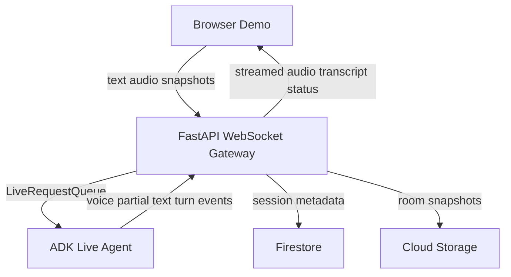

# gemini-live-agent-hack

Phase 1 of a Google Cloud-native live multimodal room-decorator demo built with FastAPI, Google ADK, Vertex AI Live, Firestore, and Cloud Storage.

If you want the full implementation story, architecture notes, design tradeoffs, prompt strategy, file map, and debugging notes for Phase 1, read [PHASE1.md](./PHASE1.md).

## Phase 1 Summary

Phase 1 turns the project into a live decorator shell:

- the user can speak instead of typing
- the agent can answer in voice
- the browser can show the room and send periodic snapshots
- the agent can guide a room scan in a decorator persona
- the user can interrupt the agent naturally

## Phase 1 Architecture



## Bootstrapping

This is the teammate-facing setup section for running Phase 1 locally from scratch.

### 1. Prerequisites

Make sure you have:

- Python 3.12 or similar installed
- Google Cloud CLI installed
- access to the target Google Cloud project
- a Firestore database already created
- a GCS bucket already created for snapshot storage

### 2. Authenticate Google Cloud

Run:

```bash
gcloud auth login
gcloud auth application-default login
gcloud config set project YOUR_PROJECT_ID
gcloud auth application-default set-quota-project YOUR_PROJECT_ID
```

Replace `YOUR_PROJECT_ID` with the real GCP project ID, not the app name unless they are the same.

### 3. Create And Activate A Virtual Environment

On macOS/Linux:

```bash
python3 -m venv .venv
source .venv/bin/activate
```

On Windows PowerShell:

```powershell
python -m venv .venv
.venv\Scripts\Activate.ps1
```

If PowerShell blocks activation:

```powershell
Set-ExecutionPolicy -Scope Process Bypass
.venv\Scripts\Activate.ps1
```

### 4. Install Dependencies

```bash
python -m pip install -r requirements.txt
```

### 5. Create `.env`

Copy `.env.example` to `.env` and fill in the real values:

```env
GOOGLE_GENAI_USE_VERTEXAI=TRUE
GOOGLE_CLOUD_PROJECT=your-gcp-project-id
GOOGLE_CLOUD_LOCATION=us-central1
FIRESTORE_DATABASE=(default)
GCS_BUCKET_NAME=your-gcs-bucket-name
ADK_LIVE_MODEL=gemini-live-2.5-flash-native-audio
LIVE_AGENT_VOICE=Aoede
LIVE_AGENT_LANGUAGE_CODE=en-US
SNAPSHOT_INTERVAL_MS=2500
APP_NAME=gemini-live-agent-hack
PORT=8080
```

Important notes:

- use `gemini-live-2.5-flash-native-audio` for Phase 1
- the old `gemini-2.5-flash-live-001` value should not be used here
- `GOOGLE_GENAI_USE_VERTEXAI` must stay `TRUE`

### 6. Start The Backend

```bash
python -m uvicorn main:app --reload
```

You should see:

- startup completes successfully
- the app validates Firestore and Cloud Storage
- no live model error appears at startup

### 7. Verify Basic Health

In another terminal:

```bash
curl http://127.0.0.1:8000/healthz
```

Then optionally inspect config:

```bash
curl http://127.0.0.1:8000/config
```

### 8. Open The Demo

Open:

```txt
http://127.0.0.1:8000/demo
```

### 9. Run The Demo Flow

1. Click `Start Live Demo`
2. Wait for the agent intro
3. Enable the mic
4. Speak and pause briefly
5. Enable the camera to send room snapshots
6. Let the agent guide the room scan
7. Use `Interrupt` to stop the agent mid-response

### 10. Quick Validation Checklist

Confirm the following:

- the page loads
- the WebSocket connects
- the agent intro appears
- the mic transcript updates
- the agent responds in voice
- camera snapshots increment in the UI
- interruptions stop playback quickly
- Firestore receives `live_sessions/{session_id}`
- GCS receives snapshot files

## Demo Flow

1. `Start Live Demo` creates the live session and opens the WebSocket.
2. The backend primes the first agent turn so the decorator introduces itself and asks for a useful room angle.
3. The mic streams 16 kHz PCM audio.
4. The camera sends periodic JPEG snapshots.
5. The agent answers in voice-first fashion and the transcript panel shows text updates.
6. Interruptions can happen by button press or natural barge-in.

## Environment Variables

```env
GOOGLE_GENAI_USE_VERTEXAI=TRUE
GOOGLE_CLOUD_PROJECT=your-gcp-project-id
GOOGLE_CLOUD_LOCATION=us-central1
FIRESTORE_DATABASE=(default)
GCS_BUCKET_NAME=your-gcs-bucket-name
ADK_LIVE_MODEL=gemini-live-2.5-flash-native-audio
LIVE_AGENT_VOICE=Aoede
LIVE_AGENT_LANGUAGE_CODE=en-US
SNAPSHOT_INTERVAL_MS=2500
APP_NAME=gemini-live-agent-hack
PORT=8080
```

## Key Files

- `main.py`
  - FastAPI entrypoint
  - `/demo`
  - `/healthz`
  - `POST /api/live/session`
  - `WS /api/live/ws/{session_id}`

- `services/live_runtime.py`
  - ADK `Runner`
  - `LiveRequestQueue`
  - Phase 1 live run config
  - event forwarding
  - live intro primer

- `agents/agent.py`
  - single live decorator `LlmAgent`

- `agents/instructions.md`
  - decorator persona
  - room-scan guidance
  - observation rules

- `services/firestore_store.py`
  - live session metadata
  - event logging

- `services/storage_store.py`
  - snapshot persistence

- `static/demo.html`
  - demo UI shell

- `static/demo.js`
  - live client behavior
  - mic capture
  - playback
  - transcript handling
  - interrupt behavior
  - browser fallbacks

- `static/audio-recorder-worklet.js`
  - 16 kHz PCM capture

- `static/audio-player-worklet.js`
  - 24 kHz PCM playback

## Validation Checklist

- `GET /healthz` returns 200
- `POST /api/live/session` returns session metadata
- the live WebSocket connects
- the agent intro is generated
- mic turns can be spoken, not just typed
- the agent answers in voice
- the transcript panel updates
- room snapshots save successfully
- the agent can comment on visible room features
- interruptions feel natural

## Common Issues

### Old Model ID

Use:

```env
ADK_LIVE_MODEL=gemini-live-2.5-flash-native-audio
```

Do not use the older `gemini-2.5-flash-live-001` value in this Phase 1 setup.

### PowerShell Activation Issues

Use:

```powershell
Set-ExecutionPolicy -Scope Process Bypass
.venv\Scripts\Activate.ps1
```

### `pip.exe` Blocked By Policy

Try:

```powershell
python -m pip install -r requirements.txt
```

### Agent Hears Its Own Audio

The client includes:

- echo cancellation
- noise suppression
- auto gain control
- self-listening protection during agent playback

If demo conditions are noisy, headphones are still the safest option.

## Cloud Run

Once the runtime service account, Firestore database, and GCS bucket exist, deploy with:

```bash
gcloud run deploy gemini-live-agent-hack \
  --source . \
  --region us-central1 \
  --allow-unauthenticated \
  --service-account YOUR_RUNTIME_SERVICE_ACCOUNT
```

## Where To Read More

- teammate setup and daily usage: this `README.md`
- full Phase 1 implementation notes: [PHASE1.md](./PHASE1.md)
